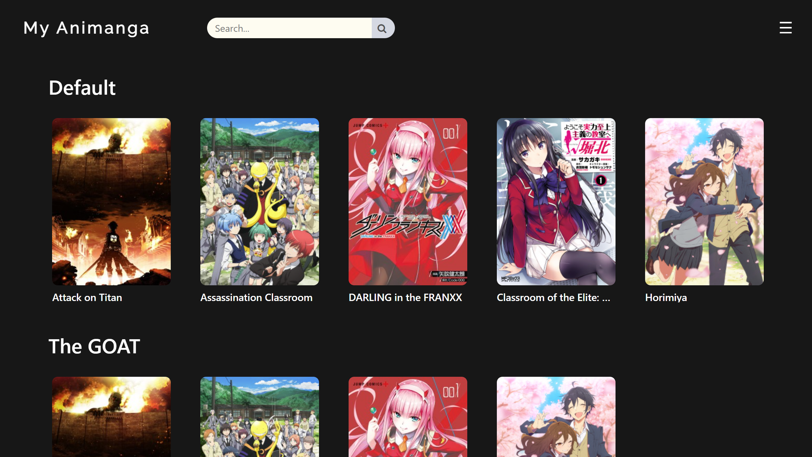

# My Animanga
A tool for anime and manga lovers to keep track of their favourite series!
## About

### Description
My Animanga, formally Anime List, is a tool for keeping track of anime and manga series. Features include:
* Search function for finding anime/manga series, search results based on [AniList Api v2](https://github.com/AniList/ApiV2-GraphQL-Docs)
* Anime/manga/both filter, SFW/NSFW filter
* Up to date anime/manga information, including title, description, cover image and genre tags
* Self rated 5 star rating system
* Keeps track of watch/read status of each episode
* Add series to custom lists, persistent list data saved to memory
* Custom list management: creation, deletion and naming
### Technology
* HTML 5: Basic structure of the application
* CSS: Styles the visual components
* JavaScript: Frontend logic
* Electron: Allows the application the run as standalone
## Getting Started
### Deployment
Download instructions for users (for Windows only):
1. Download [MyAnimanga-win32.zip](https://github.com/AustinKong/Anime-list/releases/tag/v1.0)
2. Unzip MyAnimanga-win32.zip
3. Run MyAnimanga.exe, your antivirus might stop you from running the executable, allow it to run
### Dependencies
* NodeJS
* Electron
### Installation
Installation and setup instructions for developers:
1. Install latest (LTS) version of NodeJS
2. Verify your installation by running `node -v; npm -v command` in your terminal, you should see two version outputs
3. Fork and clone the repository
4. Install project dependencies by running `npm i` from project root
5. Start coding and build something awesome!
### Contributing
This project is no longer under active development. Suggestions, issues and bug reports will not be actively resolved. However, pull requests and forks are always welcome!
## Authors
Austin Kong [@AustinKong](https://github.com/AustinKong)
## License
This project is licensed under MIT license. View license in [license.txt](license.txt)

